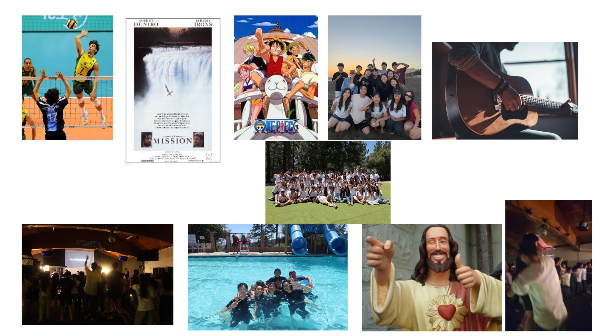

# me-in-markdown

## Letter to Mr. Aielo
Hi, my name is Sooho Lee, a 10th grade in Chatsworth Charter High school. I love to play volleyball both in and out of school and I am a follower of Christ who loves to live out his word. Each of my favorite book and movie is *The Stranger* by Albert Camus and *The Mission* featuring Robert De Niro and Jermey Irons. I first consider The Mission as my favorite movie not only because it is a great movie, but because I also learned many Christian values while watching the movie. I also like *The Stranger* because of the message of life's absurdity and the way Meursault does not compromise with this absurd world; and while this faith didn't really resonate with mine, I thought it was a philosophical belief which deserves many respect.
An interesting fact about me is that I play **guitar** for about a year now, serving in church praise team and I do **Tae Kwon do** for about 7 years now. 

My goal for this current school year would be to give all my effort in everything I do diligently within God and according to his word. To walk in a manner worthy of his name. Some sports/physical activities I enjoy doing are volleyball, cross country (running), and tae kwon do. During summer, I took part in Church VBS as a volunteer, and it was really encouraging to see different children of various age group coming together to learn about the Lord. I also took part as a library volunteer and I was able to learn and practice various skills there. I'm also interested in various creative activities and I would specifically note writing. I casually like to write poems or even short stories. I would personally like to major and work in dentistry in the future.

Some of the favorite memories I had with my friends over summer would be summer retreat and going to the beach with a group of my friends. I especially had a great time during these events not only because I was with my friends I adore, but also the way we were able to keep God in the center of it all. I overall had a great and fun time interacting with those I love and care for. There isn't much family tradition in my household, but we do have some korean tradition regarding respect towards elders. 

***Here's some of my favorite songs***: https://open.spotify.com/playlist/4SKrMXO5HC4xOw4gfAywit?si=nF52m_pzTT6IZ5nK8f6GRA&utm_source=copy-link&pi=Q0wBwFHFQkOI2&pt=d0ea3f4e8bcf4af939debb809751a7fd

## My favorite things in life
Some of the favorite things I love to do in life

